# Highly Available Web Application on AWS

##  Project Overview

This project demonstrates the design and deployment of a highly available web application architecture on AWS.

The architecture is distributed across two Availability Zones to improve availability and reduce the impact of a single point of failure.

The infrastructure was implemented manually using the AWS Management Console.

##  Architecture

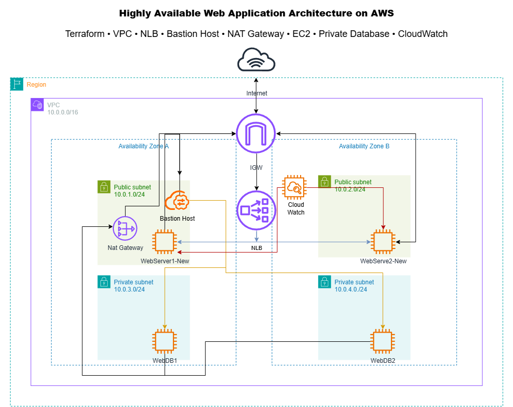

##  AWS Services Used

- Amazon VPC
- Public Subnets
- Private Subnets
- Internet Gateway (IGW)
- NAT Gateway
- Bastion Host
- Amazon EC2
- Network Load Balancer (NLB)
- Security Groups
- Route Tables
- CloudWatch

##  Network Design

VPC CIDR

```
10.0.0.0/16
```

Public Subnets

```
10.0.1.0/24
10.0.2.0/24
```

Private Subnets

```
10.0.3.0/24
10.0.4.0/24
```

##  Traffic Flow

```
Internet
      │
      ▼
Internet Gateway
      │
      ▼
Network Load Balancer
      │
 ┌────┴────┐
 ▼         ▼
Web 1    Web 2
      │
      ▼
Private Database
```

##  Security

- Bastion Host is used for secure SSH access.
- Web servers are deployed behind a Network Load Balancer.
- Databases are placed in private subnets.
- NAT Gateway provides outbound internet access for private resources.

##  Screenshots

# 📸 AWS Infrastructure Screenshots

## 1. Public Subnet 1

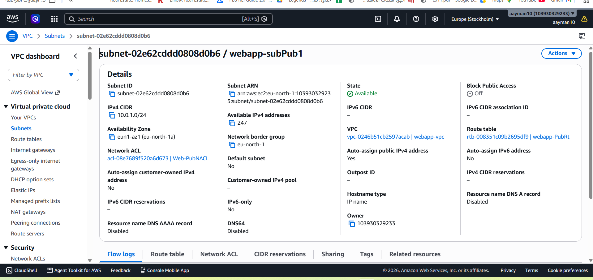

## 2. Public Subnet 2

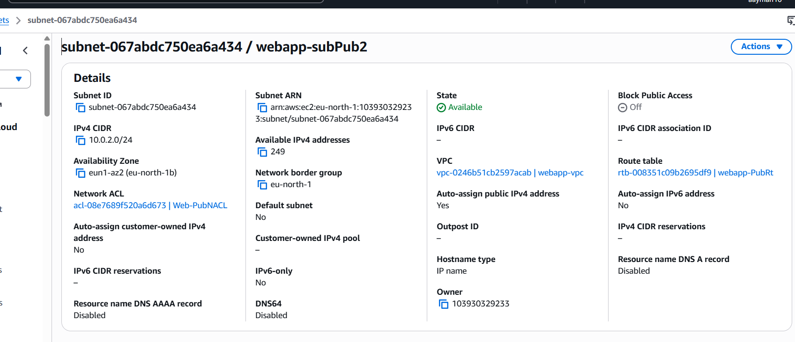

## 3. Private Subnet 1

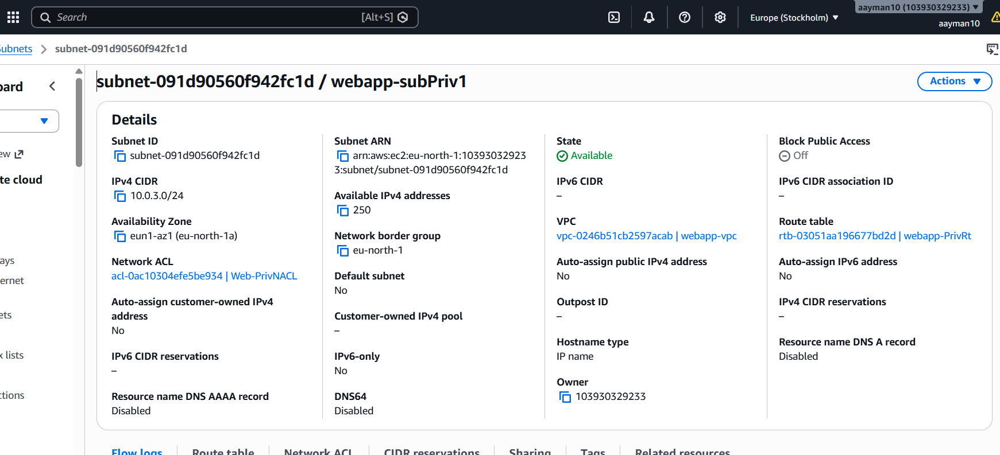

## 4. Private Subnet 2

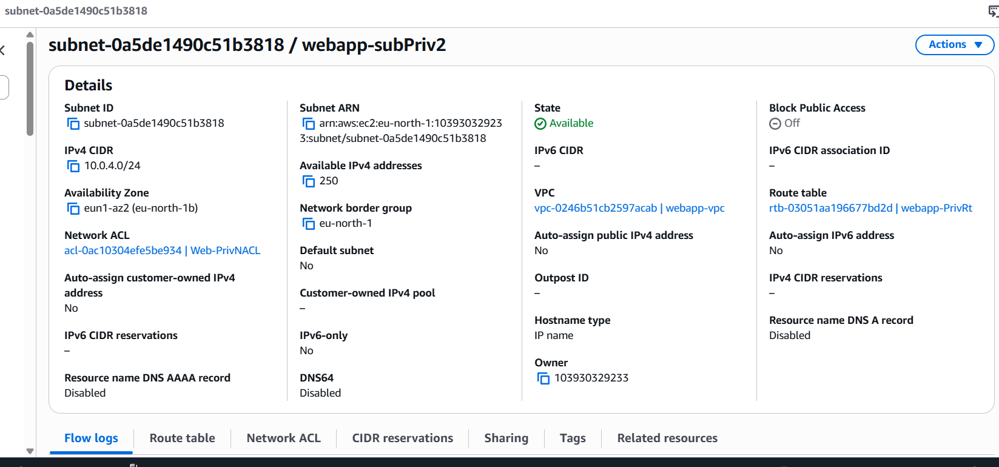

## 5. Internet Gateway

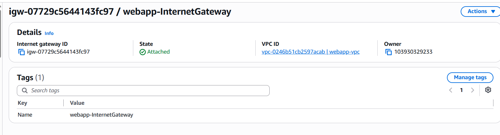

## 6. NAT Gateway

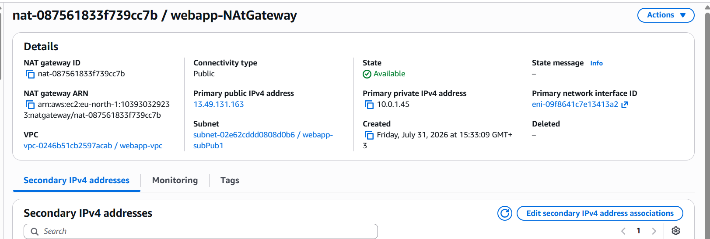

## 7. Bastion Host

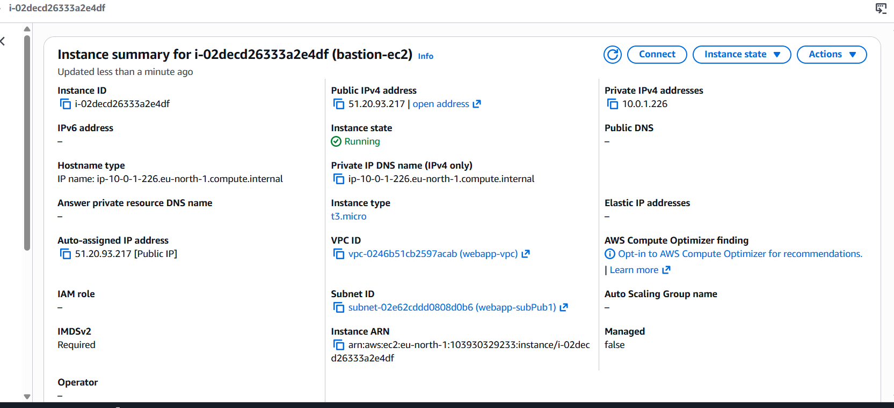

## 8. Web Server 1

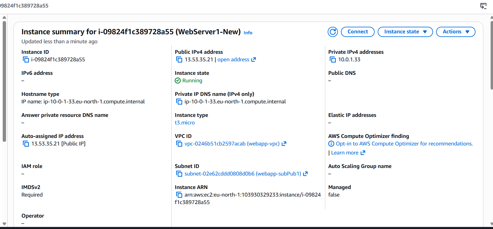

## 9. Web Server 2


## 10. Database Server 1

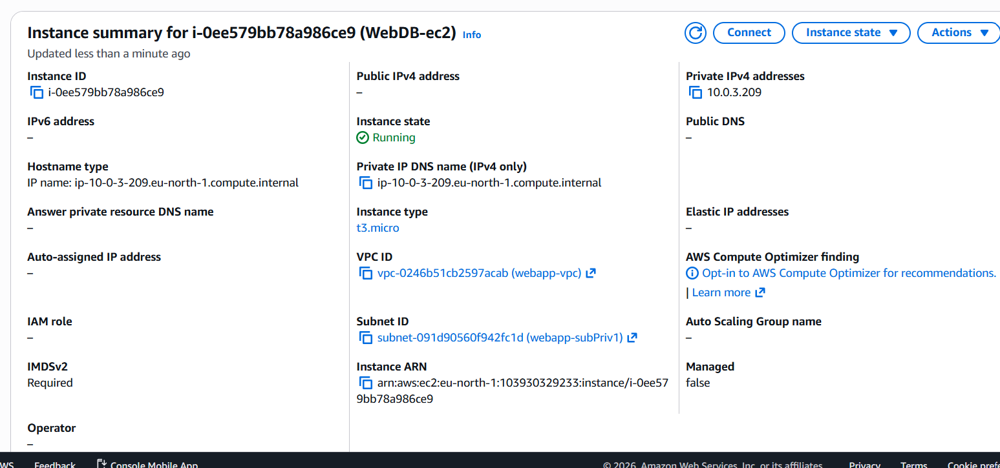

## 11. Database Server 2

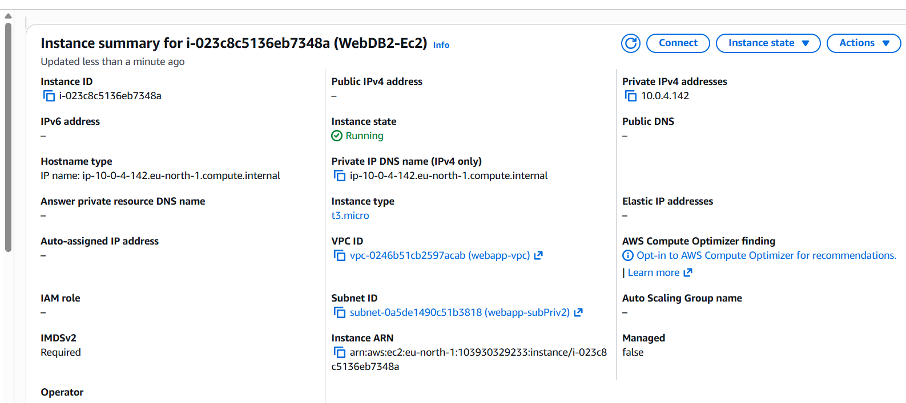

## 12. Web Server Launch Template

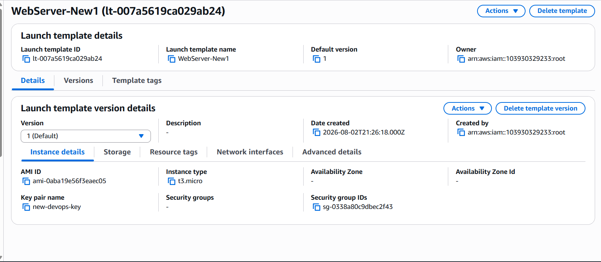

## 13. Web Server 2 Launch Template

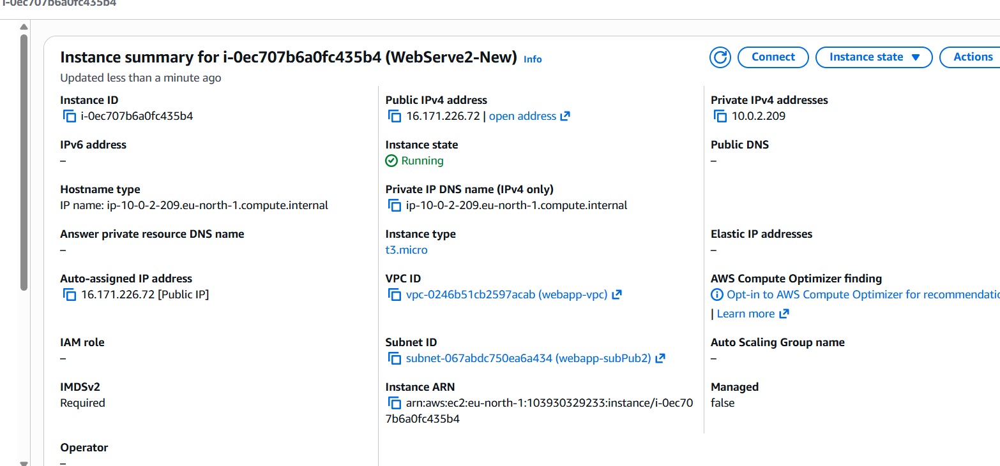

## 14. Network Load Balancer

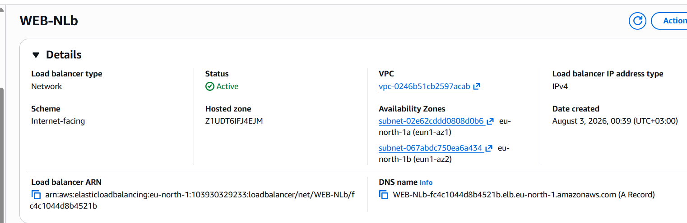

## 15. Bastion Security Group

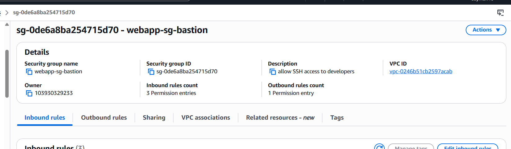

## 16. Web Application Security Group


## 17. Database Security Group

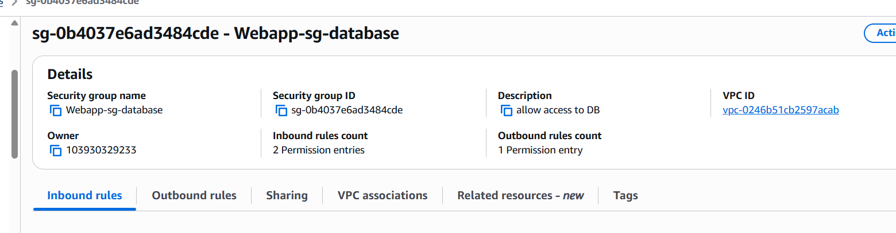

## 18. Public NACL

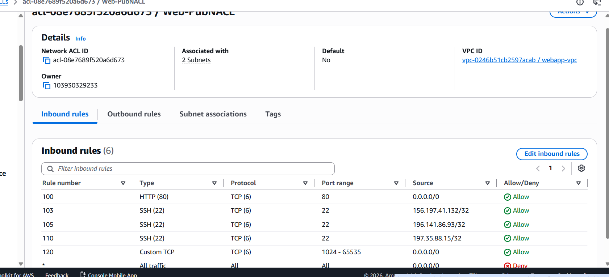

## 19. Private NACL

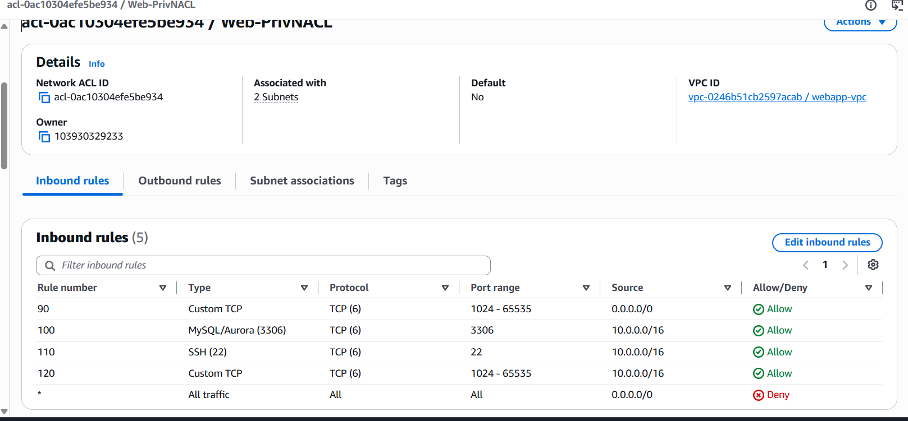

## 20. CloudWatch

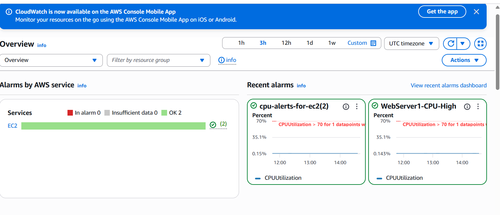

##  Lessons Learned

- AWS Networking
- High Availability
- Security Groups
- Route Tables
- Network Load Balancer
- CloudWatch Monitoring

##  Author

Ahmed Ayman Fawzy
